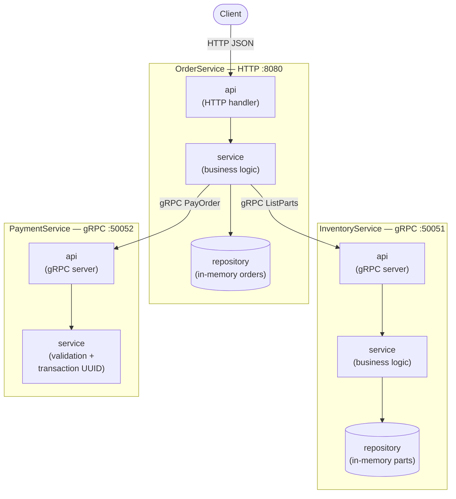
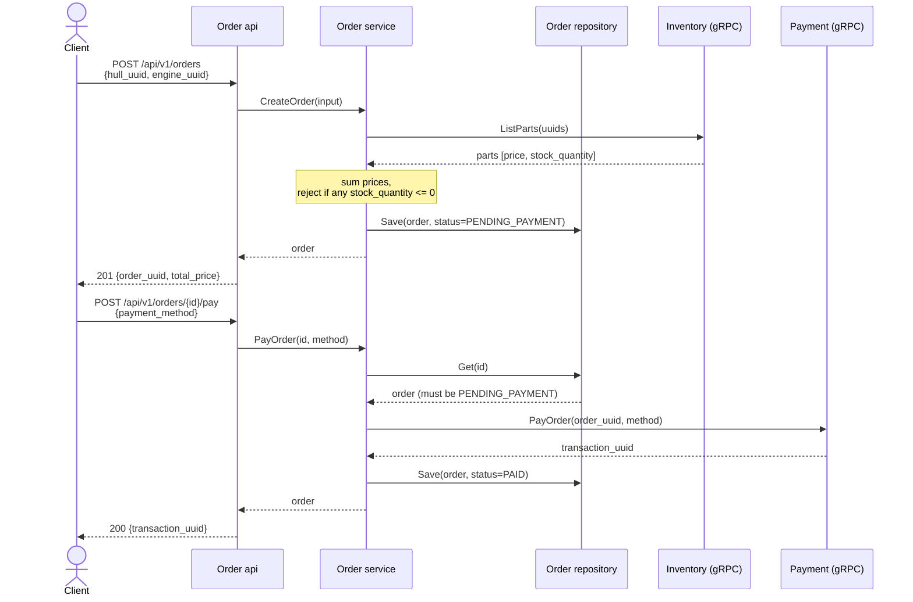

# Architecture

Three independent Go services build a toy "order a spaceship" system:

- **OrderService** — HTTP API (`:8080`), the only service a client talks to directly.
- **InventoryService** — gRPC (`:50051`), owns the parts catalog and stock.
- **PaymentService** — gRPC (`:50052`), processes payments.

Each service is split into the same three layers (`<service>/pkg/{api,service,repository}`):

- `api` — transport adapter (HTTP handler / gRPC server). Converts wire types
  ⇄ domain types, maps domain errors to status codes.
- `service` — business logic. Depends only on narrow interfaces
  (`Repository`, `InventoryClient`, `PaymentClient`), never on transport types.
- `repository` — storage (in-memory for both Order and Inventory; Payment is
  stateless).

## Component overview

`OrderService.service` is the only place that talks to the other two
services — it holds `InventoryClient`/`PaymentClient` interfaces (satisfied by
the real generated gRPC clients), which is exactly what gets swapped for
mocks in `order/pkg/service/service_test.go`.

## Example scenario: create an order, then pay for it

This is the same flow `scripts/e2e_test.sh` (`task test:e2e`) drives against
the real, independently-running processes.

## Error mapping

Business-rule failures are plain sentinel errors in `service` (e.g.
`ErrComponentOutOfStock`, `ErrOrderAlreadyFinal`, `ErrPartNotFound`) — the
`api` layer is the only place that knows about HTTP/gRPC status codes, and
maps them via `errors.Is`:

| Service layer error | Order HTTP | Inventory/Payment gRPC |
|---|---|---|
| not found (order / part / component) | 404 | `codes.NotFound` |
| invalid input (empty/malformed UUID, bad enum) | 400 (ogen validation) | `codes.InvalidArgument` |
| order already paid/cancelled | 409 | — |
| component out of stock | 409 | — |
| anything else | 500 | `codes.Internal` |
