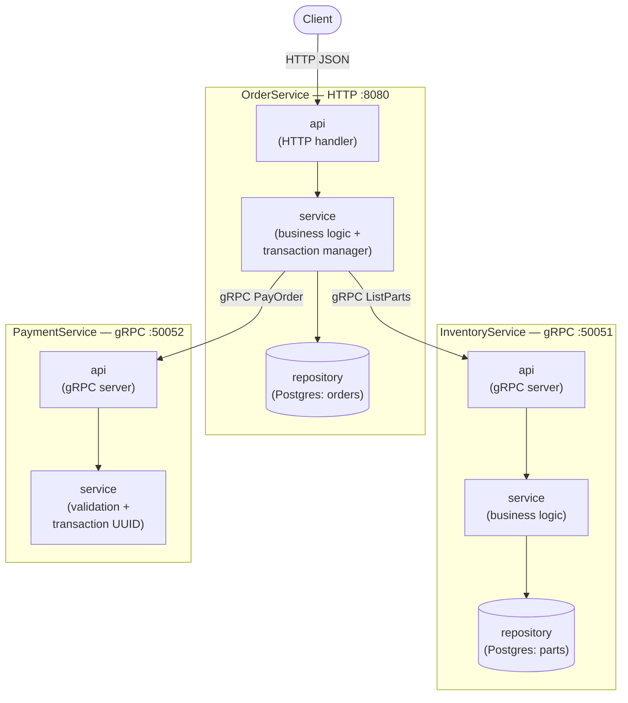
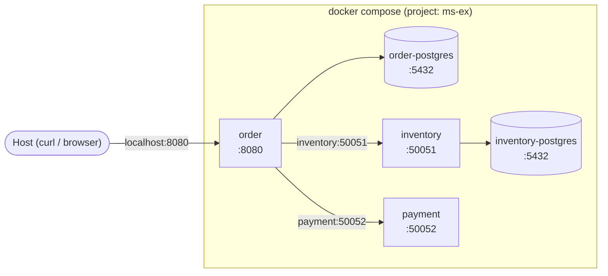
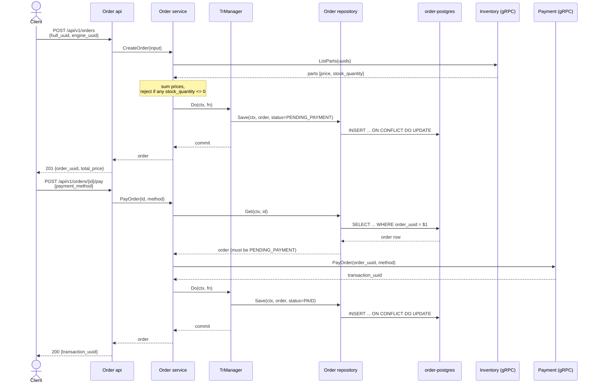

# Architecture

Three independent Go services build a toy "order a spaceship" system:

- **OrderService** — HTTP API (`:8080`), the only service a client talks to directly.
- **InventoryService** — gRPC (`:50051`), owns the parts catalog and stock.
- **PaymentService** — gRPC (`:50052`), processes payments (stateless).

Each service is split into the same three layers (`<service>/pkg/{api,service,repository}`):

- `api` — transport adapter (HTTP handler / gRPC server). Converts wire types
  ⇄ domain types, maps domain errors to status codes.
- `service` — business logic. Depends only on narrow interfaces
  (`Repository`, `InventoryClient`, `PaymentClient`), never on transport types.
- `repository` — storage. Order and Inventory are backed by **PostgreSQL**
  (`pkg/repository/postgres.go`) in `cmd/main.go` and in the Docker Compose
  stack; both also keep an in-memory implementation (`pkg/repository/memory.go`)
  used only by the self-contained test suite (`order/tests`), which
  deliberately runs with no Docker/DB. Payment has no repository — it's
  stateless.

## Component overview

`OrderService.service` is the only place that talks to the other two
services — it holds `InventoryClient`/`PaymentClient` interfaces (satisfied by
the real generated gRPC clients) and a `Repository`/`TrManager` interface
pair, all of which get swapped for mocks (or the in-memory repository + a
no-op `TrManager`) in tests — see `order/pkg/service/service_test.go` and
`order/tests/api_test.go`.

### Transaction manager (Order only)

`order/pkg/service` wraps every repository write
(`CreateOrder`/`PayOrder`/`CancelOrder`'s `Save` call) in
`trManager.Do(ctx, func(ctx) error { ... })`
([go-transaction-manager](https://github.com/avito-tech/go-transaction-manager),
pgx v5 driver). The repository itself pulls the active transaction (or the
plain pool, outside a transaction) off `ctx` via `trmpgxv5.DefaultCtxGetter`,
so it doesn't know or care whether it's in one. External gRPC calls
(`ListParts`, `PayOrder`) always happen *before* entering the transaction —
only the DB write is inside it. In tests/in-memory wiring, `TrManager` is a
no-op that just calls the function directly (a map doesn't need transactions).
Inventory has no transaction manager — it's read-only.

## Deployment

`deploy/compose/docker-compose.yaml` is the single Compose file for the
whole stack — one project (`ms-ex`), one default network, every service
reachable by container name:

- `task up` / `task stop` / `task down` — build+start, stop (keep
  containers/volumes), or stop+remove (including volumes) the whole stack.
  Each app container gets its `DB_URI` built from `ORDER_POSTGRES_*` /
  `INVENTORY_POSTGRES_*` (in `order.env` / `inventory.env`) pointed at the
  in-network Postgres hostname — not the host-side `DB_URI` in those same
  files, which is for `goose` running on the host.
- `task migrate:order:up` / `task migrate:inventory:up` (and `:down` /
  `:status`) — apply/roll back/inspect goose migrations
  (`order/migrations`, `inventory/migrations`) against the Postgres
  containers' host-published ports. Inventory's migration also seeds the
  parts catalog (the same 7 parts the in-memory repository used to
  hardcode).
- `task test:e2e` (`scripts/e2e_test.sh`) drives this exact stack: `task up`
  → migrate → curl through the scenario below plus error cases → restart the
  `order` container to prove data survived in Postgres → `task down`.

## Example scenario: create an order, then pay for it

## Error mapping

Business-rule failures are plain sentinel errors in `service` (e.g.
`ErrComponentOutOfStock`, `ErrOrderAlreadyFinal`, `ErrPartNotFound`) — the
`api` layer is the only place that knows about HTTP/gRPC status codes, and
maps them via `errors.Is`. Repository-level "not found" is likewise a plain
sentinel (`repository.ErrNotFound`, returned whether the row is missing from
a Postgres table or an in-memory map) that `service` translates into its own
domain error:

| Service layer error | Order HTTP | Inventory/Payment gRPC |
|---|---|---|
| not found (order / part / component) | 404 | `codes.NotFound` |
| invalid input (empty/malformed UUID, bad enum) | 400 (ogen validation) | `codes.InvalidArgument` |
| order already paid/cancelled | 409 | — |
| component out of stock | 409 | — |
| anything else | 500 | `codes.Internal` |
